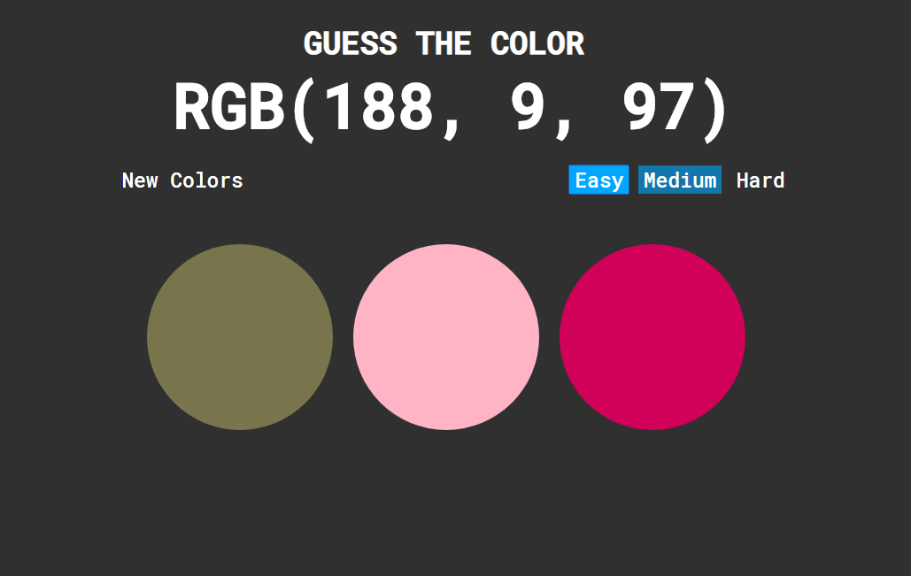
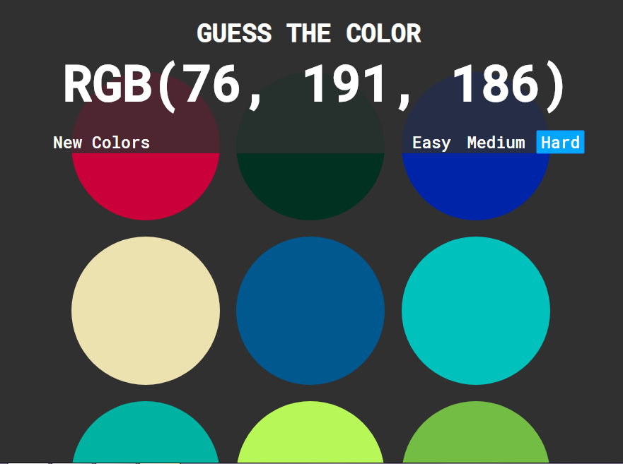
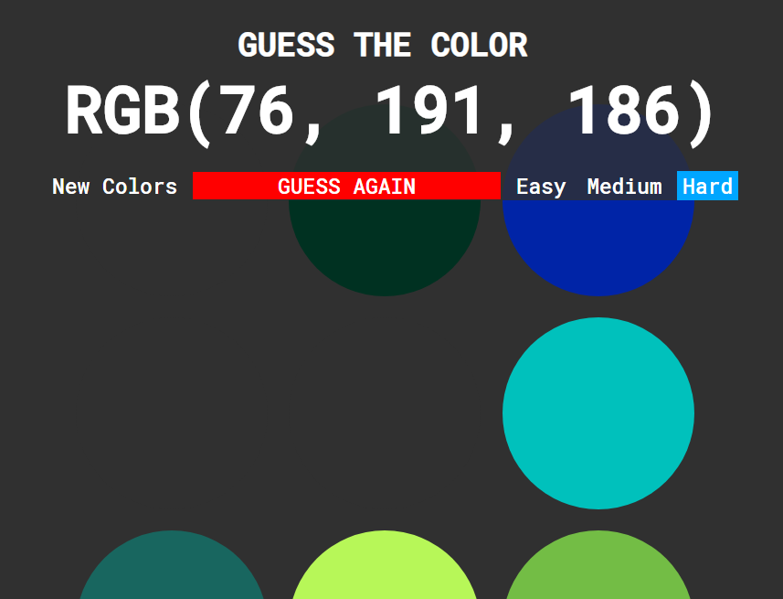
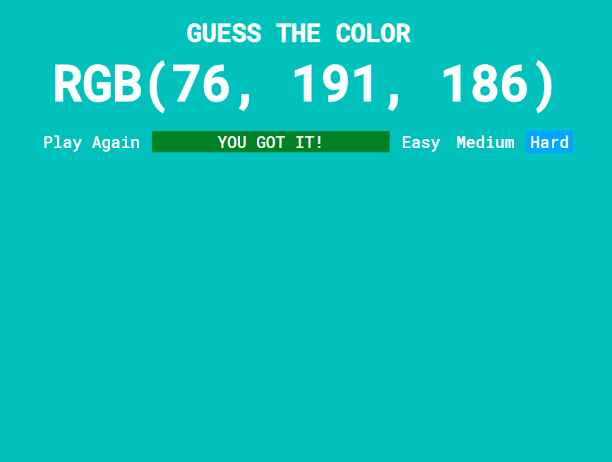

# Guess the color

A simple Javascript game where you guess the color based on its RGB value. 

Idea by Colt Steele (https://www.udemy.com/user/coltsteele/).

# Demo

https://codepen.io/kietanhtran/full/odXbEz/

# Screenshots

